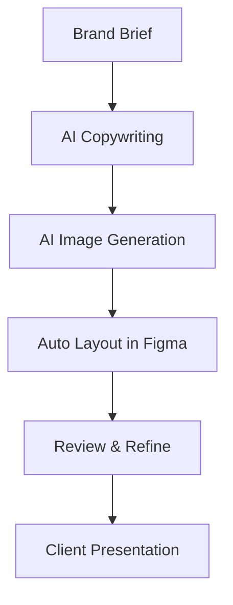
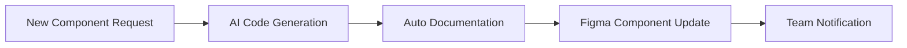

# AI Workflow Automation for Designers

Streamline repetitive design tasks and enhance your creative process with AI-powered automation.

## Overview

Transform time-consuming manual tasks into automated workflows that free you to focus on creative strategy and problem-solving.

## Common Automation Opportunities

### Content Creation Pipeline



### Design System Maintenance



## Practical Automation Examples

### 1. Social Media Content Pipeline

**Tools:** Zapier + ChatGPT + Midjourney + Canva API

**Workflow:**

```javascript
// Automated social media content creation
const socialMediaPipeline = {
  trigger: "New blog post published",
  steps: [
    "Extract key points with AI",
    "Generate social media copy variants",
    "Create supporting visuals",
    "Auto-populate Canva templates",
    "Schedule across platforms",
  ],
};
```

**Setup:**

1. Blog CMS webhook triggers Zapier
2. ChatGPT extracts key points and creates copy variants
3. DALL-E generates supporting images
4. Canva API populates templates
5. Buffer/Hootsuite schedules posts

### 2. Design Brief Processing

**Scenario:** Convert client briefs into structured design requirements

```text
Input: Raw client email
"We need a website for our new coffee shop.
Modern vibe, millennial target audience,
emphasize sustainability and local community."

AI Processing Steps:
1. Extract key requirements
2. Suggest design direction
3. Generate mood board concepts
4. Create project timeline
5. Estimate scope and budget
```

**ChatGPT Prompt Template:**

```text
Analyze this design brief and output structured requirements:

[CLIENT BRIEF TEXT]

Format response as:
- Project type:
- Target audience:
- Key messaging:
- Visual style keywords:
- Functional requirements:
- Suggested timeline:
- Potential challenges:
```

### 3. Design QA Automation

**Tools:** Figma API + Custom Scripts + AI Analysis

```python
# Automated design review script
def design_qa_check(figma_file_url):
    # Extract design elements
    elements = figma_api.get_file_elements(figma_file_url)

    # AI analysis prompts
    accessibility_check = analyze_contrast_ratios(elements)
    brand_compliance = check_brand_guidelines(elements)
    ui_consistency = validate_design_system(elements)

    # Generate report
    return generate_qa_report([
        accessibility_check,
        brand_compliance,
        ui_consistency
    ])
```

## Tool Integrations

### Figma + AI Workflows

**Auto Component Generation:**

```javascript
// Figma plugin: AI Component Builder
figma.showUI(__html__, { width: 300, height: 400 });

figma.ui.onmessage = async (msg) => {
  if (msg.type === "generate-component") {
    const prompt = msg.prompt;

    // Send to AI API
    const aiResponse = await generateComponent(prompt);

    // Create Figma nodes
    const component = figma.createComponent();
    await buildComponentFromAI(component, aiResponse);
  }
};
```

### Notion + AI Content Management

**Auto Documentation:**

```javascript
// Update design system docs automatically
const updateDocumentation = async (componentChanges) => {
  for (let change of componentChanges) {
    const aiDescription = await generateComponentDoc(change);

    await notionAPI.updatePage({
      page_id: change.componentId,
      properties: {
        Description: aiDescription,
        "Last Updated": new Date(),
        "Change Type": change.type,
      },
    });
  }
};
```

## Advanced Automation Scripts

### Batch Image Processing

```python
# Automated image optimization and formatting
import openai
from PIL import Image
import os

def process_image_batch(input_folder, output_folder):
    for filename in os.listdir(input_folder):
        if filename.endswith(('.png', '.jpg', '.jpeg')):
            # AI-powered alt text generation
            alt_text = generate_alt_text(filename)

            # Optimize for web
            img = Image.open(f"{input_folder}/{filename}")
            optimized = optimize_for_web(img)

            # Save with metadata
            save_with_metadata(optimized, output_folder, alt_text)

def generate_alt_text(image_path):
    # Use GPT-4 Vision to describe image
    response = openai.ChatCompletion.create(
        model="gpt-4-vision-preview",
        messages=[{
            "role": "user",
            "content": [
                {"type": "text", "text": "Generate concise alt text for this design image:"},
                {"type": "image_url", "image_url": {"url": image_path}}
            ]
        }]
    )
    return response.choices[0].message.content
```

### Design Asset Organization

```javascript
// AI-powered asset tagging and organization
const organizeAssets = async (assetFolder) => {
  const assets = await fs.readdir(assetFolder);

  for (let asset of assets) {
    // AI analysis for categorization
    const analysis = await analyzeAsset(asset);

    // Auto-tag based on content
    const tags = generateTags(analysis);

    // Move to appropriate folder
    const category = determineCategory(tags);
    await moveAsset(asset, `${assetFolder}/${category}/`);

    // Update asset database
    await updateAssetDB({
      filename: asset,
      tags: tags,
      category: category,
      lastModified: new Date(),
    });
  }
};
```

## ROI Measurement

### Time Tracking Template

```javascript
const automationMetrics = {
  socialMediaContent: {
    manualTime: 120, // minutes per post
    automatedTime: 15, // minutes for review/approval
    timeSaved: 105,
    postsPerWeek: 5,
    weeklySavings: 525, // minutes
  },
  designQA: {
    manualTime: 60, // minutes per design
    automatedTime: 5, // minutes for review
    timeSaved: 55,
    designsPerWeek: 10,
    weeklySavings: 550, // minutes
  },
};

const calculateROI = (metrics) => {
  const totalWeeklySavings = Object.values(metrics).reduce(
    (sum, metric) => sum + metric.weeklySavings,
    0
  );

  const hourlyRate = 75; // designer hourly rate
  const weeklyValue = (totalWeeklySavings / 60) * hourlyRate;
  const monthlyValue = weeklyValue * 4;

  return {
    weeklyTimeSaved: totalWeeklySavings,
    monthlyValue: monthlyValue,
  };
};
```

## Implementation Roadmap

### Phase 1: Quick Wins (Week 1-2)

- [ ] Set up ChatGPT for copywriting tasks
- [ ] Install Figma AI plugins
- [ ] Create prompt libraries
- [ ] Automate simple file naming/organization

### Phase 2: Process Integration (Week 3-6)

- [ ] Connect tools via Zapier
- [ ] Set up content approval workflows
- [ ] Implement basic QA automation
- [ ] Train team on new processes

### Phase 3: Advanced Automation (Month 2-3)

- [ ] Custom script development
- [ ] API integrations
- [ ] Machine learning model training
- [ ] Performance optimization

## Team Training Plan

### Workshop 1: AI Tool Foundations

- Understanding AI capabilities and limitations
- Setting up accounts and basic configurations
- Creating your first automated workflow

### Workshop 2: Integration & Optimization

- Connecting multiple tools
- Prompt engineering best practices
- Measuring and improving automation ROI

### Workshop 3: Advanced Customization

- Writing custom scripts
- API integration basics
- Troubleshooting common issues

## Monitoring & Maintenance

### Weekly Reviews

- Check automation performance
- Review time savings metrics
- Update prompts based on results
- Address any broken workflows

### Monthly Optimization

- Analyze usage patterns
- Identify new automation opportunities
- Update tool configurations
- Team feedback and training updates

## Common Pitfalls & Solutions

**Problem:** Over-automation leading to loss of creative control
**Solution:** Maintain human checkpoints at critical decision points

**Problem:** Inconsistent AI outputs affecting quality
**Solution:** Develop comprehensive prompt libraries and testing protocols

**Problem:** Tool dependencies creating workflow fragility  
**Solution:** Build fallback processes and maintain manual alternatives

**Problem:** Team resistance to new workflows
**Solution:** Start small, demonstrate clear value, provide adequate training

## Success Metrics

Track these KPIs to measure automation success:

```javascript
const successMetrics = {
  efficiency: {
    timeToComplete: "50% reduction in routine tasks",
    outputVolume: "200% increase in content production",
    errorRate: "90% reduction in manual errors",
  },
  quality: {
    clientSatisfaction: "Maintain 95%+ satisfaction",
    revisionRounds: "25% fewer revision cycles",
    brandConsistency: "100% brand guideline compliance",
  },
  team: {
    jobSatisfaction: "Focus on creative vs. routine work",
    skillDevelopment: "New AI/automation capabilities",
    productivity: "Higher value work per hour",
  },
};
```
