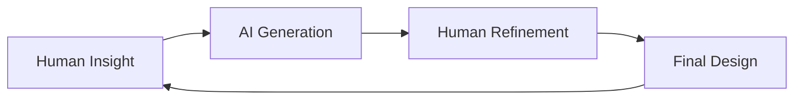

# Getting Started with AI for Designers

Welcome to your journey into AI-powered design! This guide will help you understand the basics and get you started with practical applications.


Don't worry! We'll start with the fundamentals and build up to practical applications step by step.


## What is AI in Design?

Artificial Intelligence in design refers to using machine learning algorithms and automated systems to:

- Generate creative assets
- Automate repetitive tasks
- Analyze user behavior patterns
- Optimize design decisions

## Your First AI Design Tool

Let's start with a simple prompt for AI image generation:




## Design Thinking + AI

The key is combining human creativity with AI capabilities:



## Next Steps

1. **Choose your first tool** - Start with one AI tool that fits your workflow
2. **Practice prompting** - Learn to communicate effectively with AI
3. **Set up your workspace** - Integrate AI tools into your design process
4. **Join the community** - Connect with other AI-powered designers


AI is a tool to enhance creativity, not replace it. Your design thinking and human insight remain essential.

