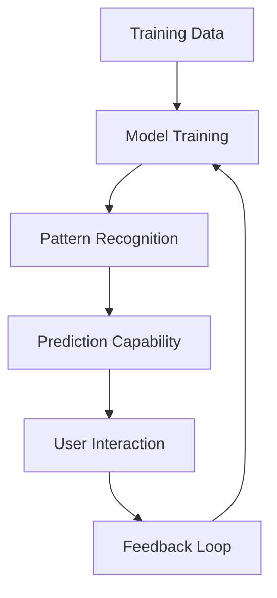

# AI Fundamentals for Designers

Understanding the core concepts will help you make better decisions about which AI tools to use and how to use them effectively.

## Key Concepts

### Machine Learning

The foundation of modern AI - algorithms that learn patterns from data without explicit programming.

```python
# Simple example: Learning color preferences
user_data = [
  {"color": "blue", "preference": 0.8},
  {"color": "red", "preference": 0.3},
  {"color": "green", "preference": 0.9}
]

# ML model learns: users prefer blue and green over red
```

### Neural Networks

Inspired by human brain structure, these process information through interconnected nodes.



### Large Language Models (LLMs)

AI systems trained on vast amounts of text that can understand and generate human-like text.



## Types of AI for Design

### Generative AI

Creates new content based on prompts and training data.

**Use cases:**

- Image generation (Midjourney, DALL-E)
- Text creation (ChatGPT, Claude)
- Code generation (GitHub Copilot)

### Discriminative AI

Analyzes and classifies existing content.

**Use cases:**

- A/B testing analysis
- User behavior prediction
- Content moderation

### Computer Vision

Understands and processes visual information.

```javascript
// Example: Analyzing design composition
const designAnalysis = {
  balance: "asymmetrical",
  colorHarmony: "complementary",
  focusPoint: "top-right",
  whitespace: "adequate",
};
```

## How AI Models Learn


AI models learn by analyzing millions of examples, finding patterns, and making predictions. The quality of training data directly affects output quality.




## Limitations to Understand

### Bias in AI

AI models can perpetuate biases present in training data.

**What this means for designers:**

- Be aware of cultural representation
- Test outputs with diverse perspectives
- Question AI suggestions critically

### Hallucinations

AI can generate convincing but incorrect information.


Fact-check AI-generated content, especially for client work or public-facing designs.


### Context Windows

AI has limited "memory" - it can only consider a certain amount of previous conversation.

## Best Practices

1. **Start with clear prompts** - Be specific about what you want
2. **Iterate and refine** - Use AI output as a starting point
3. **Combine multiple tools** - Different AI tools have different strengths
4. **Keep humans in the loop** - AI should augment, not replace, your judgment

## Quick Reference

| AI Type          | Best For                | Examples                |
| ---------------- | ----------------------- | ----------------------- |
| Text Generation  | Copy, documentation     | ChatGPT, Claude         |
| Image Generation | Concepts, assets        | Midjourney, DALL-E      |
| Code Generation  | Prototyping, automation | GitHub Copilot          |
| Analysis         | Data insights, testing  | Various analytics tools |
